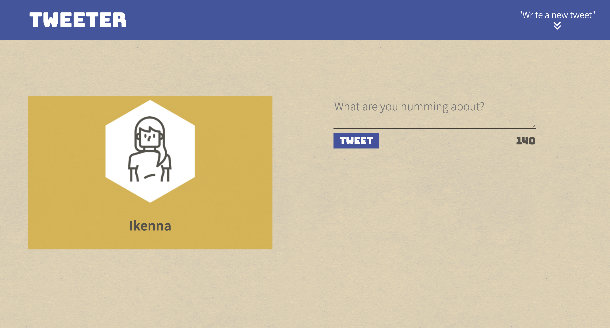
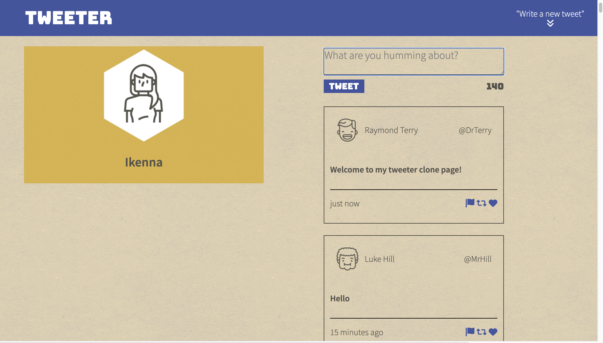
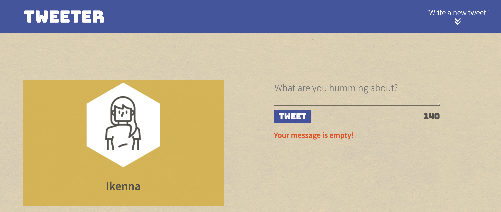
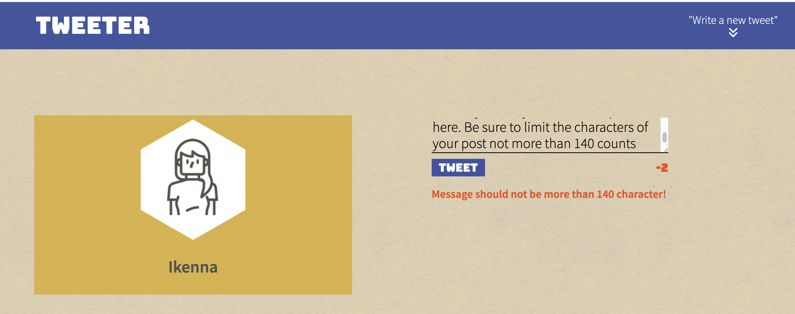
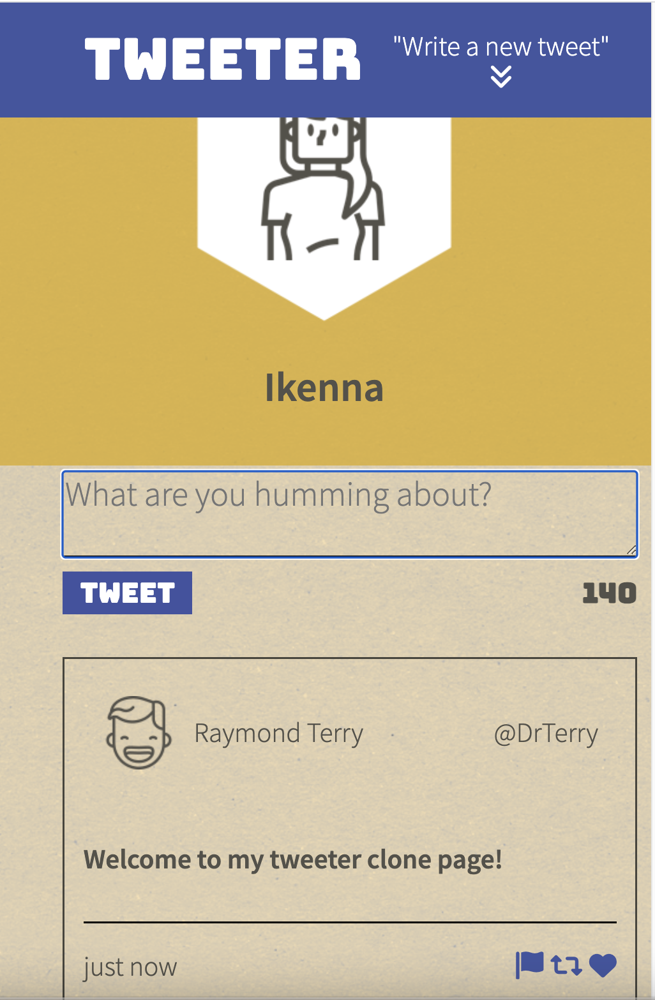

# Tweeter Project

Tweeter is a simple, single-page Twitter clone.

This repository is the starter code for the project: Students will fork and clone this repository, then build upon it to practice
The project is built using HTML, CSS, JS, jQuery and AJAX. As well as Node and Express.

## Getting Started

- Install all dependencies (using the `npm install` command).
- Run the development web server (using the `npm run local` command). The app will be served at <http://localhost:8080/>.
- Go to <http://localhost:8080/> in your browser.

## Final Product

## Dependencies

- Express
- Node 5.10.x or above